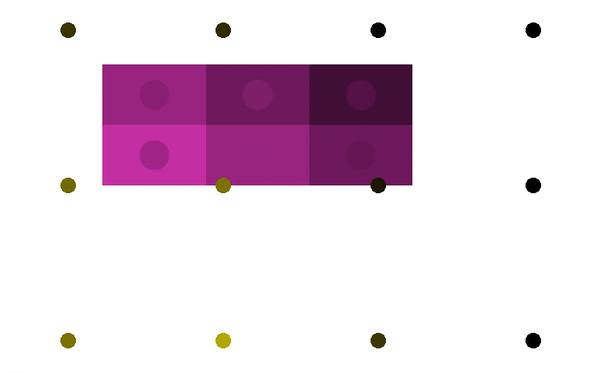

# Smart Lighting Simulation

This simulation's goal is to make lighting provide a desirable light to each user.

Currently the optimization only uses a simple heuristic because it seems hard to apply other smart algorithms to this system.

## Demo
In the demo below, the users at the desks (shown in purple rectangles) have their own request for the amount of light (illuminance; lx) on their desks, and then they all set it to 500 lx at the halfway along the demo. As the users chenge their request, 12 light sources (show in dark and bright yellow circles) adjust its luminous intensity (candela: cd) to meet the users' demand.

You see the color of the circle on each desk, which represents the actual lx on the desk, converges to the color of the desk, which represents the demanding lx of the user. Thus the optimization has been successfully completed.

