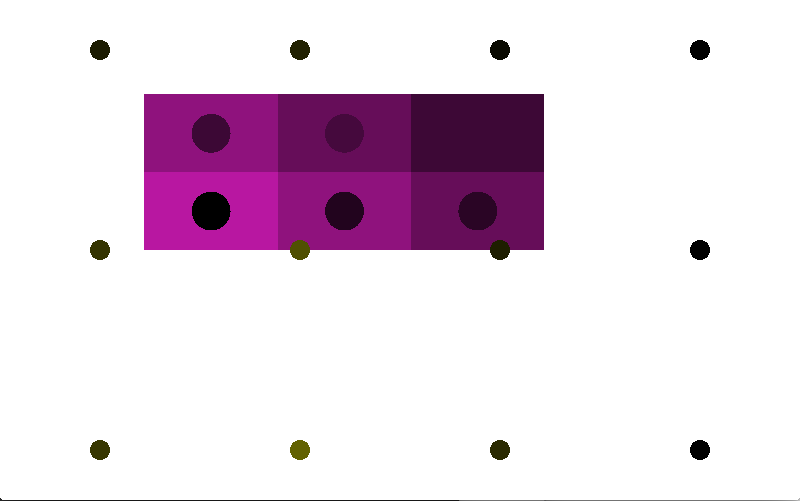
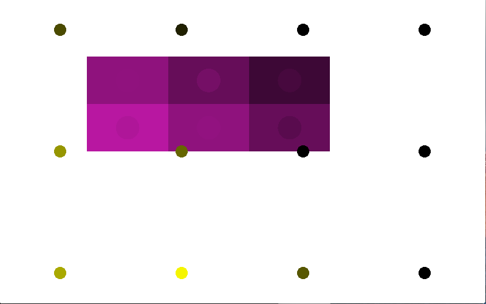

# Smart Lighting Simulation

This simulation's goal is to provide a desirable light to each user.

Currently the optimization only uses a simple heuristic because it seems hard to apply other smart algorithms to this system.

## Screen shot
Initial state:

After adjusting lights:

